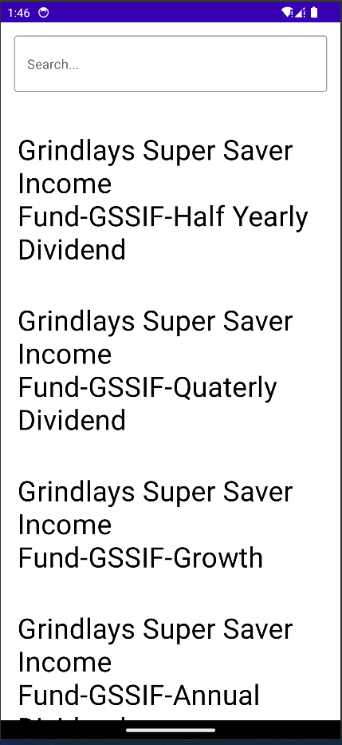
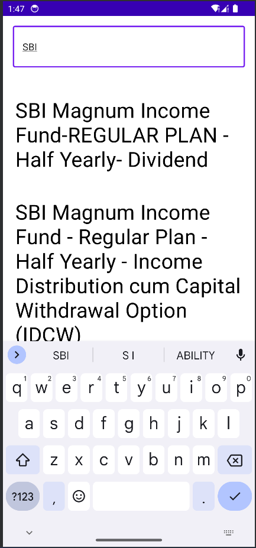
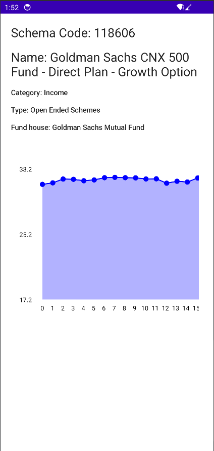
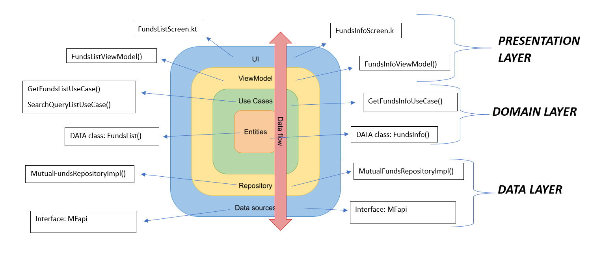

<br />
  
  <h1 align="center"></h1>
  

  
  [](https://developer.android.com/jetpack/compose)
  [](http://kotlinlang.org)
  [](https://lv.binarybabel.org/catalog/gradle/latest)

  
<p align="center">
 
  
  

</p>
  
  <p align="center">
</p>

<!-- TABLE OF CONTENTS -->
## Table of Contents

* [About the Project](#about-the-project)
* [Features](#features)
* [Architecture](#architecture)
* [Environment Setup](#requirements)
* [Contact](#contact)

  <!-- ABOUT THE PROJECT -->
## About The Project
This is sample mutual funds application developed following modern - clean architecture pattern and best practice such as SOLID principle, separation of concern, loose coupling, etc.


## Features
  - View list of Mutual Funds available in India fetched from api.
  - Search for Mutual funds from the list.
  - Get a overview information about the individual mutual fund.
      - Fund category.
      - Fund Type.
      - Fund House, etc
  - View the individual mutual fund 2 years performance(2006-2008 data) graph.
  

## Architecture


Clean architecture pattern has been used in the development of this application. 
The development language of the application is Kotlin.

Below is an illustration of clean architecture:




* Architecture;
    * [ViewModel](https://developer.android.com/topic/libraries/architecture/viewmodel)
    * [Hilt](https://developer.android.com/training/dependency-injection/hilt-android) 
    * [Navigation](https://developer.android.com/guide/navigation)
    * [Data layer](https://developer.android.com/topic/architecture/data-layer)
    * [Domain layer](https://developer.android.com/topic/architecture/domain-layer)


## Tech Stacks
This project uses many of the popular libraries, plugins and tools of the android ecosystem.
Some of Important one are listed below: 

- [Retrofit](https://square.github.io/retrofit/)
- [Coroutines](https://github.com/Kotlin/kotlinx.coroutines) - Library Support for coroutines.
- [Flow](https://developer.android.com/kotlin/flow) - Flows are built on top of coroutines and can provide multiple values.
- [Coroutines](https://github.com/Kotlin/kotlinx.coroutines) - Library Support for coroutines,provides runBlocking coroutine builder used in tests.
- [Madrapps](https://github.com/Madrapps) - Library for building line graph


- [Compose](https://developer.android.com/jetpack/compose)
  
    - [Material](https://developer.android.com/jetpack/androidx/releases/compose-material) - Build Jetpack Compose UIs with ready to use Material Design Components.
    - [UI](https://developer.android.com/jetpack/androidx/releases/compose-ui) - Fundamental components of compose UI needed to interact with the device, including layout, drawing, and input.
    - [Lifecycle-ViewModel](https://developer.android.com/jetpack/androidx/releases/lifecycle) - Perform actions in response to a change in the lifecycle status of another component, such as activities and fragments.
  
- [Jetpack](https://developer.android.com/jetpack)
  
    - [Lifecycle](https://developer.android.com/topic/libraries/architecture/lifecycle) - Perform actions in response to a change in the lifecycle status of another component, such as activities and fragments.
    - [ViewModel](https://developer.android.com/topic/libraries/architecture/viewmodel) - Designed to store and manage UI-related data in a lifecycle conscious way. The ViewModel class allows data to survive configuration changes such as screen rotations.

  

## Environment Setup
  - Android Studio ```Bumblebee (2021.1.1)```  version.
  - Android Studio's Gradle JDK version should be Java 11.0.10.
  
    
<!-- CONTACT -->
## Contact

- [Linkedin](https://www.linkedin.com/in/rushikesh-pawar-239476167/)

```xml
Designed and developed by ruship125 (Rushikesh Pawar).
